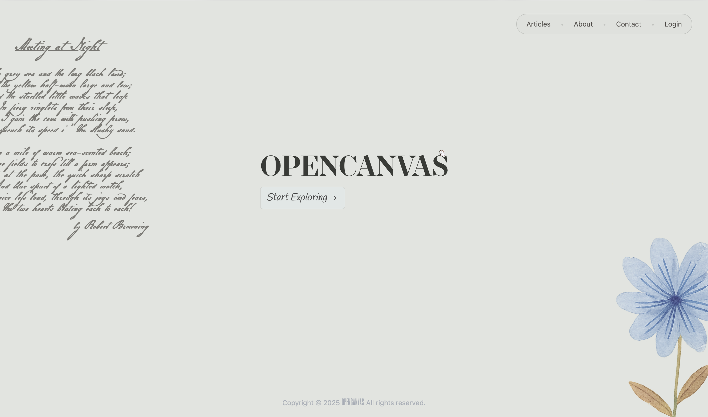
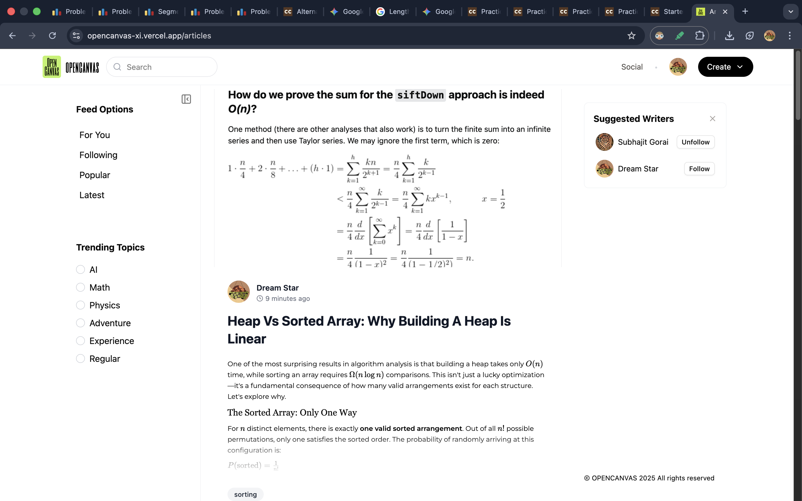
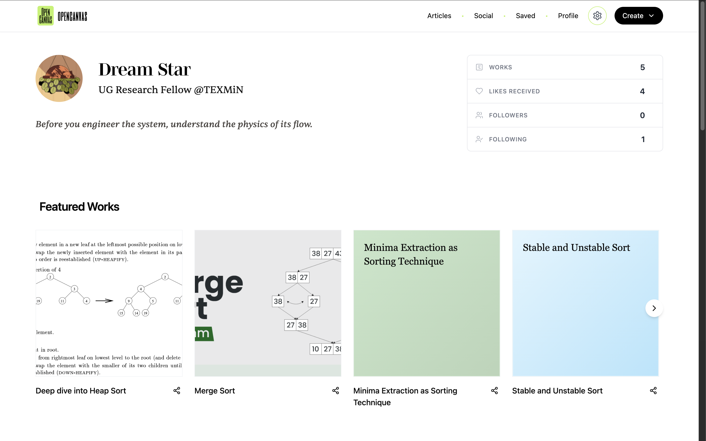
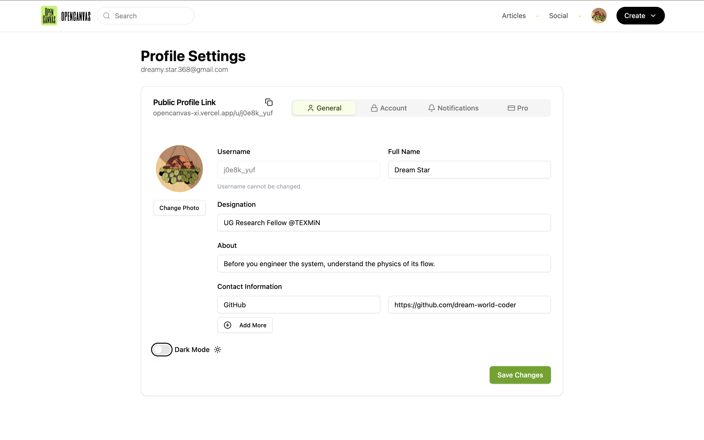
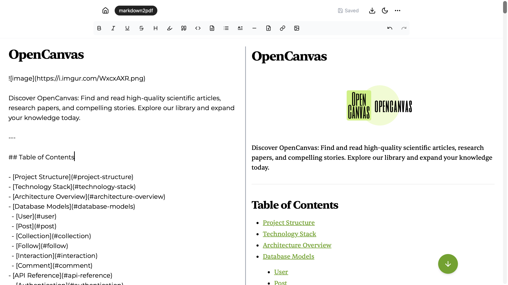
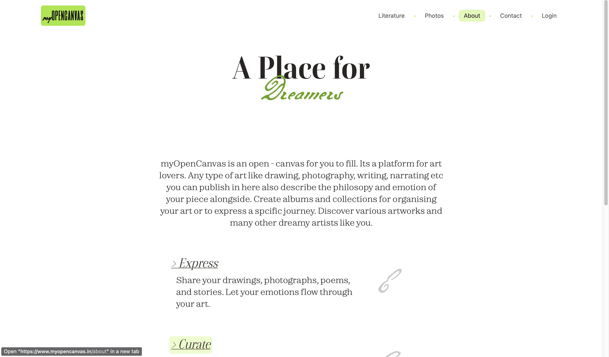
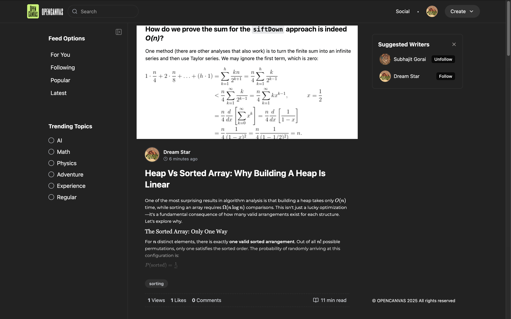
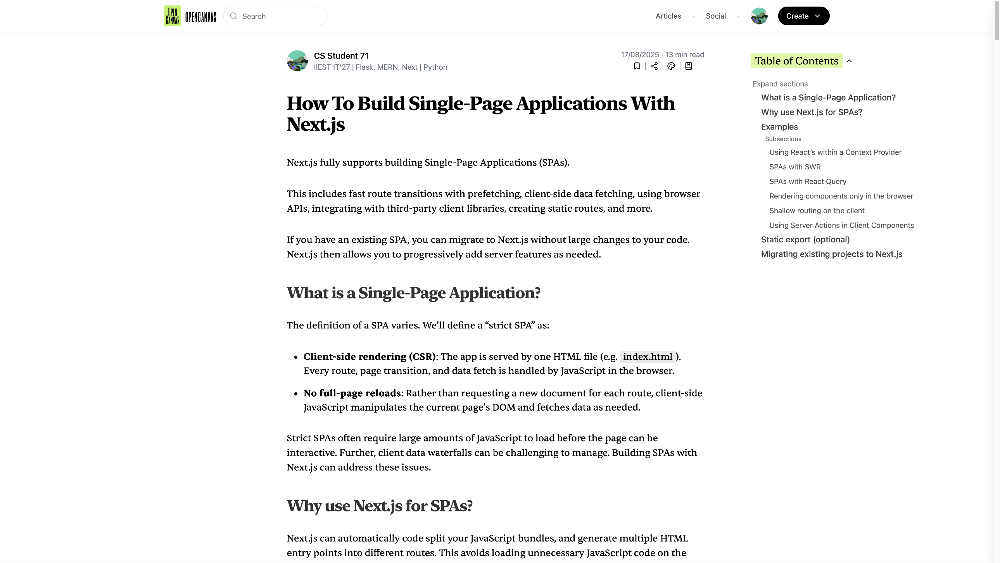

# OpenCanvas

Discover OpenCanvas: Find and read high-quality scientific articles, research papers, and compelling stories. Explore our library and expand your knowledge today.

---

## Table of Contents

- [Project Structure](#project-structure)
- [Technology Stack](#technology-stack)
- [Architecture Overview](#architecture-overview)
- [Database Models](#database-models)
  - [User](#user)
  - [Post](#post)
  - [Collection](#collection)
  - [Follow](#follow)
  - [Interaction](#interaction)
  - [Comment](#comment)
- [API Reference](#api-reference)
  - [Authentication](#authentication)
  - [Users](#users)
  - [Posts](#posts)
  - [Comments](#comments)
  - [Collections](#collections)
  - [Feed](#feed)
  - [Follow](#follow)
  - [Search](#search)
- [Authentication Flow](#authentication-flow)
- [Access Control](#access-control)
- [Engagement Scoring](#engagement-scoring)
- [Environment Variables](#environment-variables)
- [Running Locally](#running-locally)
- [Performance Benchmarks](#performance-benchmarks)
- [Support](#support)
- [Preview](#preview)


---

## Project Structure

```txt
opencanvas/
├── client/                  # React frontend (Vite)
│ └── src/
│   ├── pages/           # Route-level page components
│   ├── components/      # Shared UI components
│   ├── contexts/        # React context providers (Auth, Theme, etc.)
│   └── services/        # API call helpers (dataService.js, etc.)
└── server/                  # Express backend
  └── src/
    ├── models/          # Mongoose schemas
    ├── routes/          # Express route handlers
    ├── middlewares/     # Auth, error handling, fingerprinting
    ├── services/        # Caching, image upload, notifications
    └── jobs/            # Cron job logic

```

---

## Technology Stack

**Frontend**

- React 18 with Vite
- React Router v6
- TailwindCSS
- shadcn/ui component library
- TanStack Query for server state
- Axios for HTTP requests
- Sonner for toast notifications

**Backend**

- Node.js with Express
- MongoDB with Mongoose
- Passport.js (Google OAuth 2.0 strategy)
- JSON Web Tokens for stateless authentication
- node-cron for scheduled jobs
- Helmet for HTTP security headers
- Morgan for request logging

---

## Architecture Overview

The backend is a stateless REST API. Authentication is handled entirely through JWTs - no server-side sessions are used. Passport is only involved in the Google OAuth redirect flow; once a token is issued it is verified on every subsequent request by the `authenticateToken` middleware.

Two middleware functions are composed on protected routes:

1. `authenticateToken` - verifies the Bearer token and attaches `req.userId`.
2. `checkUserExists` - fetches the full User document and attaches `req.user`. Only used on routes that need the user's role, profile data, or sub-documents (e.g. `featuredItems`, `collections`).

Engagement data (likes, saves, follows) is stored in dedicated collections (`Interaction`, `Follow`) and also reflected as denormalised counters on the parent documents (`User.stats`, `Post.stats`). The counters are updated atomically with `$inc` and exist purely for read performance.

---

## Database Models

### User

Stores account credentials, profile data, notification preferences, and cached statistics.

| Field | Type | Notes |
|---|---|---|
| `username` | String | Unique, 4-16 chars, lowercase letters/numbers/underscores only |
| `email` | String | Unique, lowercase |
| `provider` | String | `"google"` or `"opencanvas"` |
| `role` | String | `"user"`, `"moderator"`, or `"admin"` |
| `profilePicture` | String | URL |
| `designation` | String | Max 40 chars |
| `aboutMe` | String | Max 300 chars |
| `interestedIn` | [String] | Max 8 topics |
| `contactInformation` | [ContactInfo] | Public links (title + URL), no `_id` |
| `premiumUser` | Object | Subscription status and dates |
| `stats` | Object | Denormalised counters: followers, following, posts, likesReceived |
| `collections` | [ObjectId] | References to Collection documents, max 50 |
| `featuredItems` | [FeatureItem] | Pinned posts/collections shown on profile, max 8 |
| `lastFiveLogin` | [LoginInfo] | Rolling log of last 5 logins (time, device, IP) |
| `notifications` | Object | Per-type boolean flags |

### Post

Stores the full content and metadata for a written post.

| Field | Type | Notes |
|---|---|---|
| `title` | String | Required |
| `content` | String | Full post body (Markdown) |
| `contentPreview` | String | 700 chars sliced for preview |
| `slug` | String | URL-friendly title fragment |
| `authorId` | ObjectId | Reference to User |
| `authorSnapshot` | Object | Denormalised `username`, `profilePicture`, `fullName` |
| `isPublic` | Boolean | Controls visibility |
| `isEdited` | Boolean | Set to `true` after the first update |
| `type` | String | `written`, `article`, `poem`, `story`, or `social` |
| `tags` | [String] | Max 5 |
| `media` | [String] | Uploaded image URLs |
| `stats` | Object | `viewsCount`, `likesCount`, `dislikesCount`, `sharesCount`, `commentsCount`, `readsCount` |
| `anonymousEngagementScore` | Number | Recalculated every 15 minutes by cron |
| `engagementScore` | Number | Personalised variant (reserved for future use) |

### Collection

A named, ordered list of posts created by a user.

| Field | Type | Notes |
|---|---|---|
| `title` | String | Required |
| `description` | String | |
| `isPrivate` | Boolean | Default `false` |
| `tags` | [String] | Max 5 |
| `authorId` | ObjectId | Reference to User |
| `posts` | [ObjectId] | References to Post documents, max 50 |
| `stats` | Object | `likesCount`, `dislikesCount`, `viewsCount` |

### Follow

A directional edge in the social graph between two users.

| Field | Type | Notes |
|---|---|---|
| `followerId` | ObjectId | The user who is following |
| `followingId` | ObjectId | The user being followed |
| `since` | Date | Creation timestamp (replaces `createdAt`) |

A unique compound index on `(followerId, followingId)` prevents duplicate follows.

### Interaction

Records a user's like, dislike, or save action on a Post, Collection, or Comment.

| Field | Type | Notes |
|---|---|---|
| `userId` | ObjectId | |
| `targetId` | ObjectId | Post, Collection, or Comment ID |
| `targetModel` | String | `"Post"`, `"Collection"`, or `"Comment"` |
| `type` | String | `"like"`, `"dislike"`, or `"save"` |

A unique compound index on `(userId, targetId, type)` prevents duplicate interactions.

### Comment

Supports a single level of threading: top-level comments and direct replies.

| Field | Type | Notes |
|---|---|---|
| `content` | String | Max 1000 chars |
| `authorId` | ObjectId | |
| `postId` | ObjectId | The post this comment belongs to |
| `parentId` | ObjectId | `null` for top-level; set to parent comment ID for replies |
| `authorSnapshot` | Object | `username` and `profilePicture` |
| `stats` | Object | `likesCount`, `dislikesCount`, `repliesCount` |

---

## API Reference

All responses follow the shape `{ success: boolean, data?, message?, error? }`. The `error` field is only included in development.

### Authentication

| Method | Path | Auth | Description |
| --- | --- | --- | --- |
| GET | `/auth/google` | None | Initiates Google OAuth flow |
| GET | `/auth/google/callback` | None | OAuth callback; redirects with JWT |
| GET | `/auth/user` | Required | Returns current user's full document |

### Users

| Method | Path | Auth | Description |
| --- | --- | --- | --- |
| GET | `/u/:username` | Optional | Public profile (checks follow status if token provided) |
| GET | `/u/users/byids?ids=...` | None | Batch-fetch minimal user data |
| GET | `/u/top/writers` | None | Top 5 writers by engagement (Cached) |
| PUT | `/update/user` | Required | Update own profile |

### Posts

| Method | Path | Auth | Description |
| --- | --- | --- | --- |
| GET | `/p/:slug` | None | Fetch single public post |
| GET | `/u/posts/byids?ids=...` | None | Batch-fetch public post cards |
| GET | `/u/:userId/posts` | None | Public posts by a specific author |
| GET | `/u/posts/mine` | Required | Own posts including private |
| GET | `/saved/posts` | Required | Saved posts for logged-in user |
| GET | `/get-new-post-id` | Required | Reserve new post ObjectId for editor |
| GET | `/private/p/:slug` | Required | View private post (author/mod) |
| GET | `/post/:postId/my-interactions` | Required | Like/dislike/save state for a post |
| POST | `/post/like-dislike` | Required | Toggle like/dislike |
| POST | `/post/save-unsave` | Required | Toggle save state |
| POST | `/save/post/written` | Required | Upsert written post |
| PUT | `/change-post-visibility-status` | Required | Toggle public/private |
| PUT | `/change-post-featured-status` | Required | Pin/unpin on profile |
| PATCH | `/update-post-views/:slug` | None | Increment view counter (fingerprinted) |
| DELETE | `/post/delete` | Required | Delete post |

**Post URL format:** `/p/<title-slug>-<24-char-objectid>`. The ObjectId is always the last segment and is used for the database lookup. The slug is cosmetic.

### Comments

| Method | Path | Auth | Description |
| --- | --- | --- | --- |
| GET | `/p/:postId/comments` | None | Paginated top-level comments |
| GET | `/p/comments/:commentId` | None | Single comment + direct replies |
| GET | `/get-comments/byids?ids=...` | None | Batch-fetch comments |
| POST | `/new-comment` | Required | Create top-level comment |
| POST | `/reply-to-comment` | Required | Reply to existing comment |
| PUT | `/edit-comment` | Required | Edit own comment |
| DELETE | `/delete-comment` | Required | Delete comment |

### Collections

| Method | Path | Auth | Description |
| --- | --- | --- | --- |
| GET | `/collections` | None | Browse public collections |
| GET | `/c/:collectionId` | None | Public collection + posts |
| GET | `/u/:userId/collections` | Required | User's collections metadata |
| GET | `/c/private/:collectionId` | Required | Private collection (author/mod) |
| POST | `/create/collection` | Required | Create new collection |
| POST | `/collection/:collectionId/vote` | Required | Toggle like/dislike on collection |
| PUT | `/update-collection/:collectionId` | Required | Update metadata |
| PUT | `/add-remove-post/:postId/collection/:collectionId` | Required | Toggle post in/out of collection |
| DELETE | `/delete-collection/:collectionId` | Required | Delete collection |

### Feed

| Method | Path | Auth | Description |
| --- | --- | --- | --- |
| GET | `/articles` | None | Cursor-paginated public feed (Cached) |
| POST | `/articles/anonymous-user` | None | Legacy engagement-ranked feed |

### Follow

| Method | Path | Auth | Description |
| --- | --- | --- | --- |
| POST | `/follow-unfollow/user` | Required | Toggle follow on a user |
| GET | `/u/:userId/followers` | None | Paginated followers list |
| GET | `/u/:userId/following` | Required | Paginated following list |

### Search

| Method | Path | Auth | Description |
| --- | --- | --- | --- |
| GET | `/search?q=...&type=...` | None | Global search for users and posts |

---

## Authentication Flow

1. The client redirects the user to `GET /auth/google`.
2. Google authenticates the user and redirects to `GET /auth/google/callback`.
3. The server finds or creates a User document, signs a 7-day JWT, and redirects the client to `FRONTEND_URL/auth/success?token=<jwt>`.
4. The frontend stores the token and sends it as `Authorization: Bearer <token>` on all subsequent requests.
5. Protected routes validate the token via `authenticateToken`. Routes that need the full user document additionally call `checkUserExists`.

---

## Access Control

Three roles exist: `user`, `moderator`, and `admin`.

- **Post/comment deletion:** author, moderator, or admin.
- **Private post/collection viewing:** author, moderator, or admin.
- **Collection/post management:** author only (update, feature, visibility, add/remove posts).
- **Follow/save/like:** any authenticated user.
- **Public profile, public posts, public collections, feed:** no authentication required.

---

## Engagement Scoring

The `anonymousEngagementScore` field on Post drives the ranked feed for logged-out users. A cron job runs every 15 minutes and recalculates the score for all posts using a weighted formula that combines views, likes, reads, and recency. The formula lives in `server/src/jobs/updateEngagementScore.js`.

Posts without a score are not shown in the ranked feed but do appear in the chronological `/articles` feed.

---

## Environment Variables

All variables are read from a `.env` file in the `server/` directory.

| Variable | Description |
|---|---|
| `PORT` | Server port (default: `3000`) |
| `NODE_ENV` | `"development"` or `"production"` |
| `SESSION_SECRET` | `hard to guess string` |
| `JWT_SECRET` | `hard to guess string` |
| `FRONTEND_URL` | Public URL of the frontend (used for CORS and post-auth redirects) |
| `CURRENT_URL` | Public URL of the server (used to build the OAuth callback URL), use `localhost:3000` in dev |
| `CURRENT_URL_LOCAL` | used in dev, `http://localhost:3000` |
| `MONGODB_URI` | MongoDB connection string |
| `MONGODB_URI_PROD` | MongoDB connection string |
| `IMGUR_API_URL` | `https://api.imgur.com/3/upload` |
| `IMGUR_CLIENT_ID` | your imgur client id |
| `GOOGLE_CLIENT_SECRET` | Google OAuth client secret |
| `GOOGLE_CLIENT_SECRET` | Google OAuth client secret |

All variables are read from a `.env` file in the `client/` directory.

| Variable | Description |
|---|---|
| `VITE_BACKEND_URL` | `http://localhost:3000` |


---

## Running Locally

**Prerequisites:** Node.js 18+, MongoDB running locally or a MongoDB Atlas URI.

```bash
# clone the repo
git clone git@github.com:Dream-World-Coder/opencanvas.git

# or
git clone https://github.com/Dream-World-Coder/opencanvas.git
```

```bash
# Install server dependencies
cd server
pnpm install

# Start the server
pnpm dev # single worker
pnpm devCluster # for cluster
```

```bash
# Install client dependencies
cd client
pnpm install

# Start the dev server
pnpm dev 
```

The backend listens on `http://localhost:3000` by default. The Vite dev server runs on `http://localhost:5173` and is included in the CORS allow-list automatically when `NODE_ENV` is not `"production"`.

Alternatively, use the provided shell scripts from the project root:

```bash
# for macOS only, uses homebrew
chmod +x start.sh stop.sh

./start.sh   # Start both client and server & mongodb
./stop.sh    # Stop all processes
```

And for clusters instead of a single thread:

```bash
# for macOS only, uses homebrew
chmod +x cluster-start.sh cluster-stop.sh

./cluster-start.sh   
./cluster-stop.sh    
```
---

## Performance Benchmarks

To ensure the platform scales gracefully, the database was seeded with a massive dataset: **400,000 users, 100,000 posts, 500,000 interactions, 100,000 follows, and 320,000 comments**.

### The Optimizations

To handle this volume and maximize Requests Per Second (RPS), the following backend optimizations were implemented:

* **Denormalization:** Embedded `authorSnapshot` directly into post documents.
* **Payload Reduction:** Introduced `contentPreview` (first 700 characters) to avoid sending full article bodies in the feed, saving massive bandwidth.
* **Lean Queries:** Replaced `.populate()` and utilized `.lean()` for faster read operations.
* **Aggregation & Pipelining:** Grouped database calls and utilized pipelined requests.
* **Atomic Operations:** Offloaded interaction tracking to a separate `Interaction` collection and used `$inc` for atomic stat updates on parent documents.
* **Caching:** Implemented an in-memory TTL cache for high-traffic routes like the feed.
* **Database Indexing:** Ensured proper indexing and replaced expensive `.skip()` operations with cursor-based pagination.

### Autocannon Stress Tests (The `/articles` Feed)

These optimizations yielded incredible improvements on a single Node.js thread, which were then scaled further using Node Cluster mode.

| Condition (10s Test) | Pre-Optimization | Post-Optimization (Single Thread) | Post-Optimization (Cluster Mode) |
| --- | --- | --- | --- |
| **Simple** *(100 conn)* | **1,993 RPS** (Avg: 49ms) | **6,138 RPS** (Avg: 15ms) | **15,913 RPS** (Avg: 5ms) |
| **Stressed** *(500 conn, 10 pipe)* | **2,504 RPS** (Avg: 1609ms) | **6,679 RPS** (Avg: 353ms) | **17,007 RPS** (Avg: 209ms) |

*The optimized single thread handles 2.6x more traffic under stress, and cluster mode achieves nearly a 7x increase in RPS over the unoptimized baseline.*

### Artillery Real-World Load Simulation

A comprehensive Artillery load test was run simulating a real-world scenario (Warm up → Ramp up → Sudden Viral Spike) totaling **8,600 concurrent user requests**.

The **Single Thread** performance metrics were exceptional:

* **Success Rate:** 100% (0 request failures during peak viral spike).
* **Latency Consistency:** The median response time was **1ms**.
* **Percentiles:** The p95 response time was an impressive **1ms**, and the p99 was **2ms**, proving that even the absolute slowest requests were resolved near-instantly despite the heavy cache-miss and DB stress conditions.
* **Max Latency:** Only peaked at 18ms across the entire test cycle.

---

## Support

Hi, I'm Subhajit, an IT undergrad at IIEST Shibpur. While exploring various research works, I noticed a recurring problem: countless early-stage college research papers never see the light of day. They either get stuck in the publishing pipeline or remain buried deep within individual university websites, making them incredibly difficult for enthusiasts to find.

My goal is to build a middle ground between ResearchGate and Reddit. By creating dedicated channels for specific colleges, this platform provides a centralized hub to easily publish, discover, and discuss early-stage scientific work. 

If you find this project valuable and believe in making academic research more accessible, consider supporting my work!

**Support my work:** [https://ko-fi.com/myopencanvas](https://ko-fi.com/myopencanvas)

---

## Preview







  
#### Feed dark mode

#### article desktop

