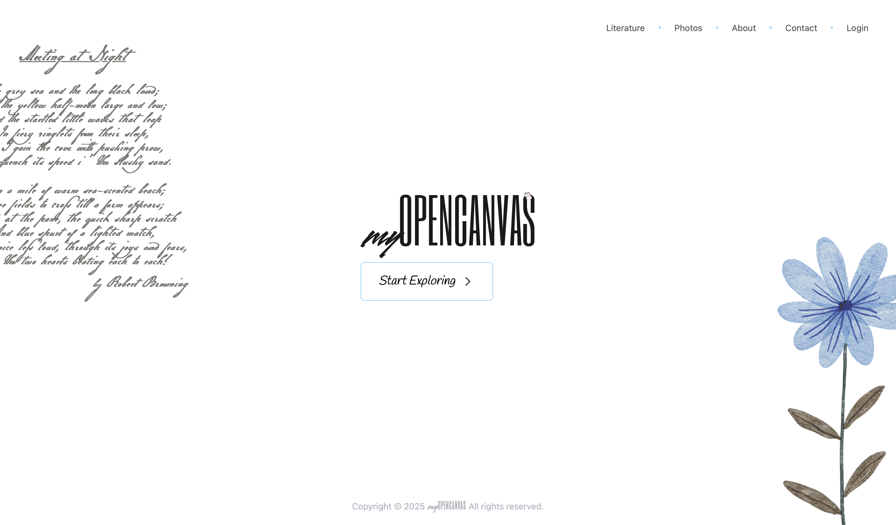
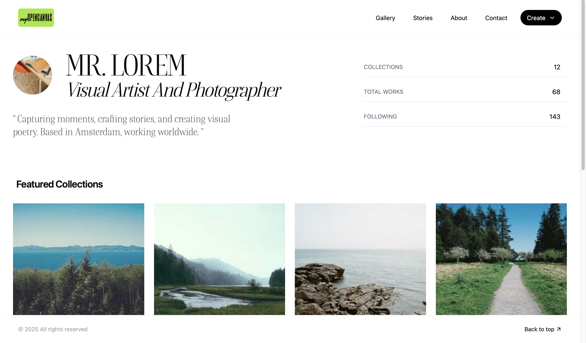

# Opencanvas

**Its a platform for art lovers. share any type of art -- like drawing, photography, poem writing, story writing,
publish your arts in one place, describe the emotions alongside if you want
create albums and collections for organising your art**

you can also discover many similar dreamy artists like you in here, also get featured

-- not social media,, so no following etc, you can save what you like though
-- no commenting on posts, if user have provided contact-info in profile you may contact then only
-- everything is shareable, your photos, stories, poems, albums, collections etc [use special compression for it/ optimise]

## opencanvas is an open-canvas -- so technical blogs, maths etc are also welcome

## also easily create e-books as your collection grows

**tech stack**

- MERN

